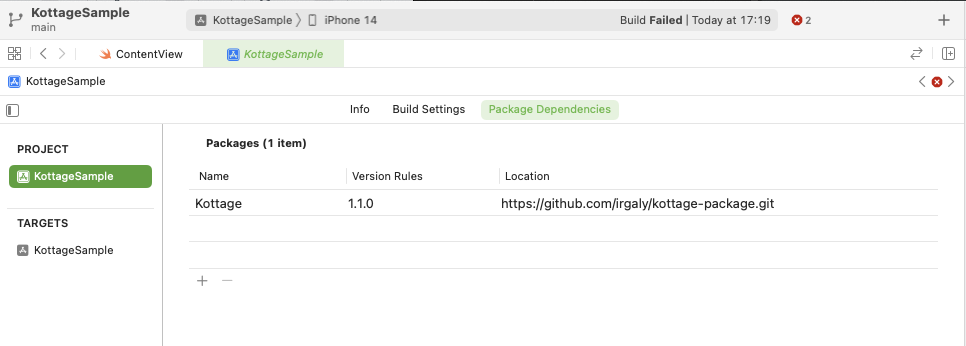

# Kottage Swift Package

[Kottage](https://github.com/irgaly/kottage) for Swift Package Manager.

**This is just a experimental build. Use this as your own lisk.**

* SwiftPM
  * Kottage.xcframework

## Xcode

Example, Xcode 14.0.1

Package Location: `https://github.com/irgaly/kottage-package.git` or `git@github.com:irgaly/kottage-package.git`

## Discussions

Kottage for Swift は試験的に設置しているものです。Kotlin Multiplatform 向けのライブラリであるため Swift から使いやすい API も用意されていません。

ご意見などがあれば以下の Discussion へお願いします。

https://github.com/irgaly/kottage/discussions/48

